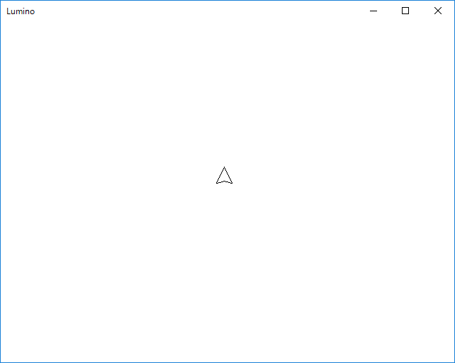

キャラクター(自機)を表示する
====================


準備
--------------------
まずは素材をダウンロードしましょう。


画像を表示してみる
--------------------
まずはこのような画像(Player.png)を表示してみます。


Main 関数を以下のように書き換えてみましょう。
```cpp
void Main()
{
	Engine::Initialize();

	// 画像を読み込み、スプライトを作成する
	Sprite2DPtr sprite = Sprite2D::Create("Data/Player.png");

	// スプライトの位置を設定する
	sprite->SetPosition(300, 200);

	while (Engine::Update())
	{
	}

	Engine::Terminate();
}
```

実行すると、以下のようにウィンドウ左上に絵が表示されます。



さて、示したコードには、新しい言葉や書き方がいくつか出てきました。順にみていきましょう。

```cpp
// 画像を読み込み、スプライトを作成する
Sprite2DPtr sprite = Sprite2D::Create("Data/Player.png");
```

このコードは、画像ファイル (Data/Player.png) を読み込み、それを2D映像として表示するためのスプライト(Sprite2D クラスのインスタンス)を作成し、そのポインタを sprite という変数に格納します。

#### スプライト
さて、まずスプライトとは何でしょうか。

スプライトとは、画像を効率よく画面に表示するための仕組みです。昨今の、ゲームエンジンなどの映像表現を旨とするツールには必ずと言っていいほど用意されている、2D画像を表示するための重要な機能です。具体的な仕組みはツールによって異なりますが、「画像を表示する」という機能は共通していますのでぜひ覚えておきましょう。

今は、スプライト = 画像 と考えておいても問題はありません。

#### インスタンスの作成
次に、インスタンス（オブジェクトとも呼ばれます）の作成について少し説明します。

多くの C++ の入門本やサイトでは、次のような文でクラスのインスタンスを作る、と解説されています。
```cpp
// Person クラスのインスタンスを作成する
Person* person = new Person();
```
もう一度サンプルコードを示しましょう。読み替えはそれほど難しくないはずです。（"Sprite2DPtr" の "Ptr" は「ポインタ」と言う意味のサフィックスです）
```cpp
Sprite2DPtr sprite = Sprite2D::Create("Data/Player.png");
```
さて、なぜ素直にポインタ型や new を使わないのでしょうか？

Lumino が公開する Sprite2D クラスなどは、「スマートポインタ」という仕組みで管理されます。これはインスタンスが不要になった時点で自動的に delete する仕組みで、これによっていわゆる「解放忘れ」を防いでいます。

通常、以下のように new　したら対となる delete を行わなければなりません。
```cpp
Person* person = new Person();

// なにか処理をする

delete person;
```

Lumino では「クラス名::Create」という関数で作成したインスタンスの delete は不要です。
というより、**delete してはなりません。**

これは Lumino を使う上で重要なことですので、忘れないでください。


スプライトの位置を設定する
--------------------

次のコードは、作成したスプライトに対して「あなたの位置はこの座標です」と指定しています。
```cpp
// スプライトの位置を設定する
sprite->SetPosition(300, 200);
```
2D空間の座標の単位はピクセル(px)です。このコードでは、ウィンドウの左上から、右へ300px、下へ200pxの位置を指定しています。

スプライトは、ウィンドウ上で画像の左上がこの位置になるようにして画像を描画します。


まとめ
--------------------

本章では画像の表示方法を説明しました。また、Lumino が用意しているクラスのインスタンスを作る注意点も説明しました。

画像の表示については、Windows API のようにプログラマがビットマップデータを用意して直接描くのではなく、
スプライトというオブジェクトに対してファイル名や位置などの情報を渡して自動的に描いてもらう、というのが Lumino の基本スタンスです。
（Lumino に限らず、Unity など多くのツールでは効率的な描画のため、このような仕組みになっています）

次章では、キーボードなどの入力を受けとりキャラクターを移動させていきます。

