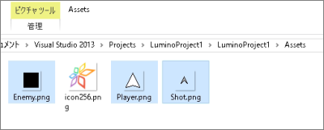

Lumino によるシューティングゲーム作成のチュートリアル
====================

前提
--------------------
1. C/C++ の基本知識
    * C言語については、変数、配列、ポインタ、関数、構造体、制御構造、基本的な標準ライブラリ (printf や fopen) の知識は一通りあることを前提としています。
    * C++ については、クラス、new/delete を使ったことがある程度で大丈夫です。クラスやオブジェクト指向的な考え方は、チュートリアルの中で簡単な説明を行います。ただし、文法的な説明は行いません。C++の入門本などを手元においておくことをお勧めします。

2. Visual Studio の知識
    * コンソールアプリケーションのプロジェクトを作成し、実行できる程度で大丈夫です。

準備
--------------------
1. [開発環境の準備](../Common/1.md) で Lumino をインストールし、プロジェクトを作成してください。

2. [こちら](Resource/Assets.zip?raw=true) から本チュートリアルで使用する素材をダウンロードし、プロジェクトの Assets フォルダに解凍してください。

目標
--------------------
- Lumino で簡単なゲームを開発・公開するまでの流れがわかること。
- Lumino で 2D ゲームを作るための基本的な機能がわかること。

構成
--------------------
1. [キャラクター(自機)を表示する](1.md)

2. キャラクター(自機)を移動する

3. 弾を撃つ

4. ソースコードの整理 (クラス化)

5. 敵を表示する

6. 衝突判定を作る

7. 敵を倒した時の処理を作る

8. ゲームオーバーの処理を作る

9. スコアを画面に表示する

10. BGM、効果音を鳴らす

11. 作品を公開する

